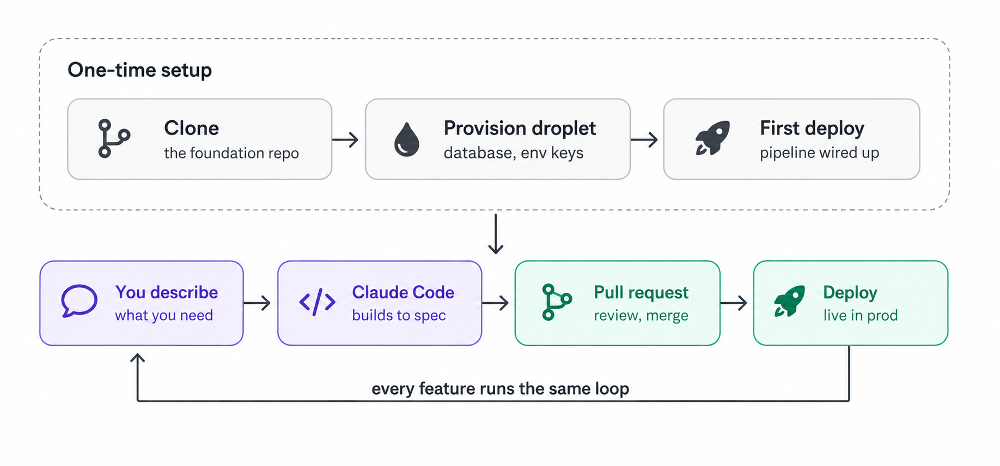

# backflip

A full-stack **platform foundation** for kicking off new projects fast — auth, admin dashboard, database, and UI system already wired, so you build features instead of boilerplate.

Stack: Next.js 16 · React 19 · Tailwind v4 · shadcn/ui · Drizzle + Postgres · Auth.js · Turborepo · yarn 4.


> **Self-hosted starter.** You run this yourself and supply your own secrets. The values in `.env.example` are local-dev defaults only — generate real secrets before deploying anywhere (see [Security](#security)).

## How it works
Set up once — clone, [provision a droplet](./devops.md), first deploy — then every feature runs the same loop: describe it, let Claude Code build to spec, review the PR, deploy.



## Prerequisites
- **Docker Desktop** (running) — for Postgres
- **Node ≥ 20** with **corepack** (pins `yarn@4.17.1` — always run `corepack yarn …`)

## Run it locally

**1. Create env files (first time only).** Copy the templates:
```bash
cp .env.example .env
cp .env.init.example .env.init      # one-off owner seed — see step 2
```
Create **`.env.local`** (runtime Auth.js secrets) with:
```
AUTH_SECRET=replace-with-openssl-rand-base64-33
AUTH_TRUST_HOST=true
```
Generate a real secret with `openssl rand -base64 33`. Edit **`.env.init`** with your
`ADMIN_EMAIL` / `ADMIN_PASSWORD` — it's read only by `init-owner`, never by the app,
and can be deleted once the owner is seeded.

**2. Install, set up the database, run:**
```bash
corepack yarn install
docker compose up -d         # start Postgres (backflip-db) only
corepack yarn db:migrate     # create tables
corepack yarn init-owner     # seed admin from .env.init
corepack yarn dev            # app → http://localhost:3070
```

## Log in
- Sign in at **http://localhost:3070/backflip/login** with your `ADMIN_EMAIL` / `ADMIN_PASSWORD`.
- **After editing env:**
  - changed `ADMIN_*` in `.env.init` → rerun `corepack yarn init-owner`
  - changed `AUTH_*` (incl. Google) in `.env.local` → **restart `yarn dev`** (env loads at startup)
- Google login is optional — add `AUTH_GOOGLE_ID` / `AUTH_GOOGLE_SECRET` (redirect URI `http://localhost:3070/api/auth/callback/google`); works only for already-registered emails.

## Tests
```bash
corepack yarn workspace web test        # unit (Vitest) — fast, no database needed
corepack yarn workspace web test:e2e    # e2e (Playwright) — needs `docker compose up -d`
```
E2e boots its own app on port `3170` against a dedicated `backflip_test` database —
your dev server and dev data are untouched. First run on a machine also needs the
browser once: `corepack yarn workspace web exec playwright install chromium`.
Optional: `corepack yarn workspace web test:e2e:screenshots` captures key pages
into `.screenshots/` (gitignored).

## Production: seed the owner once, then delete the secret
The owner seed is a **one-off kickoff step**. Run it a single time against the prod
database, then delete the credentials file:

```bash
cp .env.init.example .env.init   # then edit: real ADMIN_EMAIL + a strong ADMIN_PASSWORD
corepack yarn init-owner         # creates the owner row — idempotent, safe to re-run
rm .env.init                     # remove the secret once you can sign in
```

Deleting `.env.init` is all that's needed — the `ADMIN_PASSWORD` lives only there.
The seed script isn't imported by the app, isn't in the build, and does nothing
without `.env.init` (it throws on a missing `ADMIN_EMAIL`), so it's harmless to leave
in place. Re-seed anytime by recreating `.env.init` and rerunning `init-owner`.

> Optional cleanup: to drop the tooling entirely, `git rm .env.init.example
> packages/db/src/seed/owner.ts`, remove the `init-owner` entry from `package.json`
> + `packages/db/package.json`, and prune the `L2-DB-04/13/15` doc lines. Pure
> hygiene — restore from git history to seed another owner later.

## Good to know
- **Ports**: app `3070`, Postgres `5544` (change `POSTGRES_PORT` in `.env` if it clashes).
- **Secrets**: set a real `ENCRYPTION_KEY` in `.env` (`openssl rand -base64 32`) — it encrypts stored secrets (AI provider keys).
- **DB changes**: edit `packages/db/src/schema.ts` → `corepack yarn db:generate` → `db:migrate`.
- **Admin dashboard UI** is built from shadcn blocks — browse and lift components/layouts from **https://ui.shadcn.com/blocks** (this project uses `login-03`, `dashboard-01`, `sidebar-08`).
- **Full Docker** (app + db): `docker compose --profile web up -d --build` → migrations run, app on `3071`. Owner seed: `docker compose --profile seed run --rm db-seed`.
- More commands + conventions: `.claude/skills/dev-workflow`.

## Deployment
Deploy to a DigitalOcean droplet — from your machine, GitHub Actions, or Drone CI.
See [devops.md](./devops.md).

## Security
Before deploying, generate real secrets — never reuse the `.env.example` defaults:
- `AUTH_SECRET` → `openssl rand -base64 33`
- `ENCRYPTION_KEY` → `openssl rand -base64 32`
- a strong `ADMIN_PASSWORD` and unique database credentials.

To report a vulnerability, see [`SECURITY.md`](./SECURITY.md).

## License
[MIT](./LICENSE) © dev-geddy
