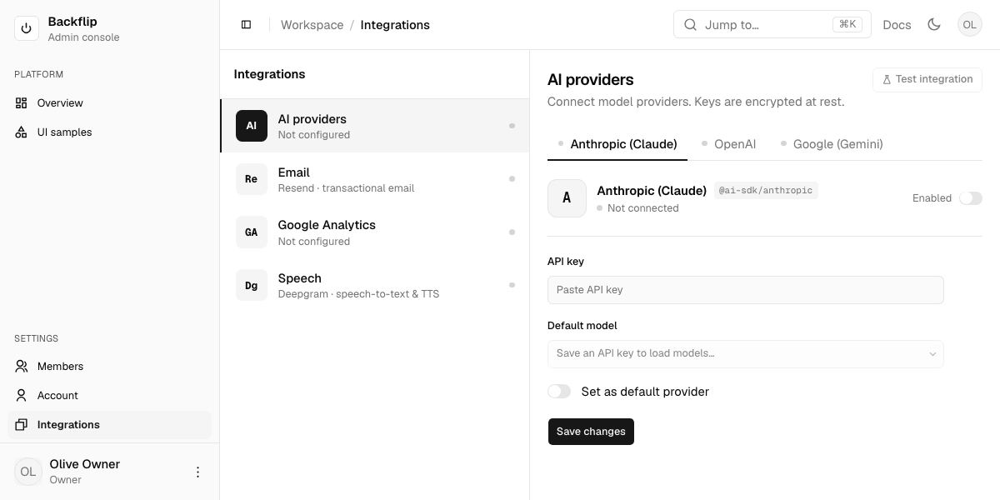

# Notes (L3) — ui

> L3 = how / volatile. AI writes free. Cites L2 IDs up. Matches code as-is.

## File map
- `packages/ui/src/components/*.tsx` — shadcn component set. Satisfies `L2-UI-01`.
- `packages/ui/src/lib/utils.ts` — `cn()`. Satisfies `L2-UI-02`.
- `packages/ui/src/styles/globals.css` — theme tokens + Tailwind `@source` globs. Satisfies `L2-UI-03`. `@source` paths are relative to this file (4 levels up = repo root): `../../../../apps/**`, `../../../../components/**`, `../**` (packages/ui itself). All consumer `.tsx` must be covered or their utility classes aren't generated.
- `packages/ui/components.json` — shadcn config. Satisfies `L2-UI-06`, `L2-UI-07`.
- `apps/web/app/layout.tsx` — mounts ThemeProvider + TooltipProvider + Toaster. Satisfies `L2-UI-04`, `L2-UI-09`.
- `apps/web/app/page.tsx` — public marketing homepage (RSC/SSR). Composes `_components/`: `SiteHeader`, `Hero`, `CapabilityList`, `FeatureList`, `HowItWorks`, `ClaudeConnector`, `WordmarkBand`, `SiteFooter`. Sets page `metadata`. Satisfies `L2-UI-11` (proposed).
- `apps/web/app/_components/*` — homepage sections (app-scoped, `L1-ARCH-07/08`): `site-header.tsx` (`"use client"` — sticky nav + wordmark + `ThemeToggle`, links use `Button render={<a/>}`), `theme-toggle.tsx` (dark/light switch via `useTheme`, mount-guarded; `variant` outline|ghost + `className` props — shared by public and admin headers), `brand-icon.tsx` (shared arc glyph SVG — used by the public wordmark and the admin sidebar logo tile: bordered `bg-card` tile + `text-primary` glyph on both), `hero.tsx` (headline + CTAs over CSS stripe texture, no image; primary CTA → `/getting-started`, outline CTA "Fork it, make it yours" → GitHub's `/fork` route in a new tab — the "Open Admin" CTA was dropped, a first-time visitor has no account to open), `capability-list.tsx` (5 `CAPABILITIES` — the non-technical mirror of the feature list, see below), `feature-list.tsx` (5 `FEATURES`), `numbered-list.tsx` (the row layout both of them render), `how-it-works.tsx` (3-step band on `bg-muted`; "Clone" card CTA → GitHub repo (new tab), "Configure" card CTA → `/getting-started`, "Ship" card CTA → `/getting-started/start-building` (outline `Button render={<a/>}`)), `claude-connector.tsx` (RSC — MCP connector section: eyebrow + heading + 3 unnumbered `Card`s, deliberately NOT `NumberedList` since the three facts are parallel, not sequential; copy claim-checked against `docs/contracts/mcp.md` — read-only, off by default, role-scoped), `wordmark-band.tsx` (oversized `text-muted-foreground/20` accent), `site-footer.tsx` (copyright line also carries `AppVersion`), `app-version.tsx`. Theme tokens only, no hex. Icons remixicon only.
- `apps/web/app/getting-started/page.tsx` — three-phase index (RSC, static): hero + `PHASES` sections (01 Discover / 02 Set up / 03 Start building), each a lead + guide cards; linked from the homepage "Configure" card. Satisfies `L2-UI-18`.
- `apps/web/app/getting-started/intro/page.tsx` — discovery page (RSC, static): what Backflip is, `IN_THE_BOX` + `AUDIENCE` card grids, CTA → setup wizard. Satisfies `L2-UI-18`.
- `apps/web/app/getting-started/start-building/page.tsx` — prompts-only page (RSC, static): `PROMPTS` (4 copy-ready coding-agent prompts — contact form, admin view, Resend notification, spam/polish) rendered via page-scoped `_components/prompt-block.tsx` (client — copy-to-clipboard prose card, wraps, no shell gutter). Linked from homepage "Ship" card. Satisfies `L2-UI-18`.
- `apps/web/app/getting-started/setup-on-digitalocean-droplet-docker-flavour/page.tsx` — placeholder (RSC, "Coming soon" badge): docker-flavour guide lands after the docker setup/deploy scripts are verified end-to-end; links to the pm2 guide + index. Satisfies `L2-UI-18`.
- `apps/web/app/getting-started/setup-on-digitalocean-droplet/page.tsx` — public guided deploy walkthrough (RSC shell, `metadata.title` "Setup on a DigitalOcean droplet"); composes `SiteHeader` → `GuideHero` → `SetupGuide` → `SiteFooter`. Prerenders static. See "Getting-started guide route"; satisfies `L2-UI-18`.
- `apps/web/app/getting-started/setup-on-digitalocean-droplet/_components/*` — page-scoped (`L1-ARCH-07/08`): `guide-hero.tsx` (RSC, homepage stripe-texture backdrop, smaller clamp), `setup-vars.ts` (plain module — `SetupVars`, `resolve()`, one builder per command block; `@spec L2-DEVOPS-01, L2-DEVOPS-02, L2-DEVOPS-06`), `variables-form.tsx` (client — the single shared form + its guidance layout), `field-guidance.tsx` (client — step-1 focus-driven help panel), `command-block.tsx` (client — copy-to-clipboard `<pre>` + `<placeholder>` token highlighting, `compact` variant), `setup-guide.tsx` (client island — owns `SetupVars` + step index, sessionStorage persistence, Back/Next/Reset), `setup-steps.tsx` (client — `STEPS` metadata + `StepBody`, all guide copy; step 1 "Get a droplet" — image/size/ssh-key/DNS checklist, ssh-keygen block (keygen lives here, not in the variables sidebar) + DigitalOcean referral-link CTA (m.do.co, labeled as referral); step 2 "Clone" — local software checklist (git, Node 24 + corepack, OpenSSH/openssl) + clone/install block + Claude-Code-primary note (other agents untested); final Summary step renders + downloads `backflip-setup-summary.txt` via Blob — values incl. owner password with a keep-private warning, plus day-two command reference from `summaryDocument()` in setup-vars), `wizard-stepper.tsx` (client — numbered clickable progress dots).
- `apps/web/app/backflip/(protected)/users/page.tsx` — admin Members surface (RSC). Selects `users` display fields + `emailVerified`/`createdAt` (no hash), newest first; derives per-member `loginMethods`, `usesGoogle`, `status` (Active/Pending) + workspace counts; renders `MembersView`. Sidebar `Users` links here. (Members master-detail — see "Members (design 1A)".)
- `apps/web/app/backflip/(protected)/ui-samples/page.tsx` — component demo, admin-only (moved from public `/ui-samples`; auth-gated by the edge proxy, second Platform nav item below Overview, capability `dashboard`). Public header/footer/hero links now point to `/getting-started`. Dashboard/masonry layout reproducing the `base-mira` create-preview; exercises ~50 components (item, field, input-group, native-select, toggle-group, chart/recharts, empty, spinner, progress, calendar, radio, table, tabs, accordion, …). `d` = dark toggle. Satisfies `L2-UI-05`, `L2-UI-12`. Note: uncontrolled `defaultValue` passed to base-ui ToggleGroup/Slider must be stable module-scope refs (base-ui warns on identity change per render).
- `apps/web/next.config.ts` — `transpilePackages: ["@workspace/ui"]`. Satisfies `L2-UI-10`.

## Admin flat restyle ("Flat Admin" design) — L2-UI-03
Protected `/backflip/*` surface restyled to a flat, hairline aesthetic (imported from claude.ai/design "Flat Admin"). **Theme tokens unchanged** — already flat-neutral; radius already matches (cards `rounded-xl` ≈ 11px, controls ≈ 7.6px). Restyle is component/layout only.
- Shared primitives: `(protected)/_components/page-heading.tsx` — `PageHeading` (large tracking-tight title + muted subtitle + optional trailing `action`) and `SectionLabel` (uppercase `text-xs` micro-label). Layout-scoped (`L1-ARCH-08`).
- `section-cards.tsx` — flat stat cards: `SectionLabel` + big `tabular-nums` value + optional unit / emerald·red delta / slim progress bar / emerald status dot + muted caption. No `Card`/`Badge` chrome.
- `site-header.tsx` — see "Admin chrome (design-matched)".
- `account/page.tsx` — design "My account": `PageHeading` + profile summary card + bordered "Account details" list (`border-t` hairline rows wrapping Profile/Email/Password sections) + Login methods card. Section summary rows reshaped to `w-32` muted label | value | trailing button; email shows mono value + emerald "Verified" pill; password shows masked dots. Edit forms unchanged (functionality preserved).
- `settings/page.tsx` — Integrations master-detail (see "Integrations page"). `@spec L2-AI-01, L2-EMAIL-01` unchanged.
- Menu unchanged: Dashboard/Users/Account/Settings (no items added).
- Green pills use `emerald-*` utilities (only non-token color; light+dark variants). Everything else theme tokens.

## Admin chrome (design-matched) — L2-UI-03
Sidebar + header + shell now match the Flat Admin design layout (a later pass superseded the earlier "sidebar not restyled" note). Menu items/routes unchanged (Dashboard/Users/Account/Settings).
- `(protected)/layout.tsx` — sidebar switched from `variant="inset"` (floating) to **flush** (default `variant="sidebar"`, border-right); `--sidebar-width: 15.5rem`, `--header-height: 3.5rem`; content area on a soft `bg-muted/40` canvas so white panels/cards pop; passes `userName`/`userInitials` to the header.
- `app-sidebar.tsx` (client) — bordered `bg-card` **brand tile** (`BrandIcon`, `text-primary` — same mark as the public wordmark) + "Backflip" / "Admin console" subtitle; nav split into labeled groups **Platform** (Overview) + **Settings** (Users, Account, Integrations) via `SidebarGroupLabel`; the Settings group is `mt-auto` (pinned to the bottom, above the user footer, which has `border-t border-sidebar-border`); **active** state from `usePathname` (`isActive`, exact for `/backflip`, prefix otherwise); groups filtered by `can(role, cap)`.
- `nav-user.tsx` — footer chip now shows role (was email); dropdown (Account / Log out) unchanged.
- `site-header.tsx` (client) — `usePathname` breadcrumb trail (e.g. Settings / My account), `SidebarTrigger`, right-aligned Docs link (internal `/backflip/docs`, `L2-UI-20`) + `ThemeToggle` (shared `app/_components/theme-toggle.tsx`, ghost `size-7`) + avatar. Breadcrumb `nav` and the right cluster are both shrinkable (`min-w-0`, `truncate` / `shrink`) so the header never forces horizontal scroll on narrow viewports.
- Removed: `nav-main.tsx`, `nav-secondary.tsx` (nav inlined into `app-sidebar`).
- Nav labels renamed to design: **Overview** (was Dashboard) + **Integrations** (was Settings; icon `RiCheckboxMultipleBlankLine`). Routes/capabilities unchanged (`/backflip`, `/backflip/settings`, caps `dashboard`/`settings`). Menu item type `text-[13px]`, group labels `text-[11px]` to match a1.
- **Full-bleed content:** shell (`layout.tsx`) drops all outer padding/gap — content area is edge-to-edge on a `bg-muted/40` canvas. Master-detail pages (`MembersView`, `IntegrationsView`) are one flush region, no rounded cards/gaps (list `lg:w-[372px] lg:border-r` | detail `flex-1` | rail `w-[300px] xl:border-l p-4`). **Split surfaces:** shell root stays `bg-card` (detail + rail sit on it, rail keeps its `bg-muted/50` tint over card); the **list column is explicitly `bg-background`** so it matches the header/`SidebarInset` canvas. (Overview/Account differ: their canvas = ui-samples `bg-muted dark:bg-background`, content surface = `bg-card`.) Holds in both mobile states (list `w-full` below lg, detail `flex-1` when `mobileDetail`). Padded pages own their padding: dashboard + `account` wrap in `p-4 md:p-6` (account stays `max-w-5xl` centered).
- `header-search.tsx` + `overview-jump.tsx` — quick-jump: `⌘K` `CommandDialog` (cmdk) over shared `jump-targets.ts` (`JUMP_GROUPS`) → `router.push`. Compact button in `site-header`; large field on Overview.
- Sidebar `collapsible="icon"` (was offcanvas) → contracted = 60px icon rail (design 1B); `--sidebar-width-icon: 3.5rem`; logo/user buttons get `group-data-[collapsible=icon]:p-0!` so tile/avatar fit. **Icon-only when contracted:** `p-0` alone was not enough — the brand label block and the user chip's label + `RiMore2Line` are `flex-1`/`ml-auto` siblings that keep their intrinsic width, so inside the 32px button (`overflow-hidden`, `justify-center`) they pushed the icon out of the box (measured brand tile `x = -24px`, footer avatar `x = -8.5px` — the mark disappeared). Both label blocks now carry `group-data-[collapsible=icon]:hidden` so they leave the flow entirely. Guarded by `e2e/admin-chrome.spec.ts`. Header divider is a plain `h-4 w-px bg-border` span (base-mira `Separator` forces `data-vertical:self-stretch`, so it stretched/misaligned — a fixed span centered by the header's `items-center` is reliable).

## Overview page — design 5A (L2-UI-03)
`/backflip` rebuilt from generic stat-cards/chart/table to the 5A home. **Real data only.**
- `page.tsx` (RSC) — greeting (`Welcome back, {firstName}`, real date) + `OverviewJump` + 3 real stat cards (Members total/active/pending, Integrations enabled + health dot, Pending) + 2 info cards: **Finish setting up** (4 real steps derived from name/user-count/ai/email config) + **Recent members** (newest 4 from `users`). Full-bleed, `max-w-[900px]` centered; canvas mirrors ui-samples (`bg-muted dark:bg-background`, hero stripe backdrop removed), each card `rounded-xl border bg-card p-5` (was a flat `bg-card` page with borderless-bg cards).
- Removed: `section-cards.tsx`, `dashboard-chart.tsx`, `recent-table.tsx`.
- `_components/overview-jump.tsx` — large quick-jump field opening the shared command palette.
- Bottom of the page column renders `AppVersion` (see version marker below), centered, same low-contrast treatment as the public footer.

## Members page — design 1A master-detail (L2-UI-03; auth domain UI)
`/backflip/users` ported from a flat card list to a 3-column master/detail (design "Flat Admin" 1A). **Layout-faithful, real-data-only** — no schema/action changes; unsupported design chrome omitted.
- `users/_components/types.ts` — `Member` (+ derived `status`, `usesGoogle`, `joined`), `WorkspaceCounts`. `MemberStatus` = `active` (has login method OR `emailVerified`) | `pending` (neither). No "suspended" (no backend).
- `members-view.tsx` (client shell) — selection + `mode` (overview/edit/new) + search/filter state; `flex h-full min-h-0 bg-card` 3 cols (list `lg:w-[22rem]` + `bg-background`, detail `flex-1` + `bg-card`, rail `xl:` only). < lg: list/detail stack via `mobileDetail` toggle + back control.
- `members-list.tsx` — header + count + `New` (owner), search, filter pills (All/Active/Pending), rows (avatar, name + mono email, Google icon from `loginMethods`, status dot), selected = `border-l-2 border-primary bg-muted`.
- `member-detail.tsx` — reproduces design 1a: 52px avatar header (status dot · role, Edit); **Overview** `justify-between` def-rows (Member ID mono = `users.id`, Email + "Verified", Role, Sign-in method + circle-`G` `GoogleMark`, Date added = `createdAt`); header `HeaderActions` = Edit + kebab (`RiMore2Line`, hidden for self) → **Remove user** with an `AlertDialog` confirm → new `deleteUser` action; on success `onRemoved` clears selection + revalidates. **Edit** — "Edit member" title + 2-col grid (Full name, Email, Role full-span) → existing `updateUser` (self-role-lock kept); **New** form (name/email/role radio-cards/optional password) → existing `POST /api/backflip/users` + `router.refresh()`. 1a's Team/Two-factor/Status-edit/kebab omitted (no backend). Folds in the removed dialogs.
- `member-rail.tsx` — permissions card (✓/— live from `can(member.role, cap)`), workspace stat counts, static help card.
- Omitted (no backend): bulk suspend/delete, kebab disable/remove/mark-unverified, Team, Two-factor, Suspended status, last-active.
- Removed: `users-list.tsx`, `add-user-dialog.tsx`, `edit-user-dialog.tsx`. `_actions.ts` `updateUser` + REST route unchanged.

## Account page — design 4a (L2-UI-03; auth domain UI)
`/backflip/account` ported to the "My account" 2-column: details left, security rail right. **Real-data-only**, actions unchanged.
- `account/page.tsx` — also selects `emailVerified`. Full-bleed 4a layout: main column (`max-w-[900px]` content, matches Overview card width, `p-6 lg:p-8`) + a right rail with `border-l` (stacks under main < lg with `border-t`). Passes `emailVerified` + `loginMethods` to rail + email pill.
  - **Canvas mirrors ui-samples** (`bg-muted dark:bg-background`), main column and rail alike; only cards keep `bg-card` (profile summary, "Account details" list, both rail cards). Was `bg-card` main + `bg-muted/50` rail. Same treatment as the Overview page; inline edit forms stay `bg-muted/40`.
  - Rail width is stepped: `lg:w-64` (256px) → `xl:w-80` (320px), so the main column keeps usable width on ~1200px viewports instead of being squeezed by a fixed 320px rail. Rail and main content both carry `min-w-0` so neither blocks shrinking.
- `_components/profile|password|email-section.tsx` — summary→edit switched from swap to **inline-expand** (row stays; form drops below on `bg-muted/40`).
  - Email: 2-step `Stepper` (Details → Verify). Step 1 = real `requestEmailChange` (new email + current-password step-up when `hasPassword`); on `state.ok` → step 2 amber "check your inbox" (link-based, deferred swap). **No 6-digit codes.** Verified pill driven by real `emailVerified`.
  - Password: `changePassword` unchanged + a **client-only strength meter** (`strength()` heuristic: length + char-class → 4-seg bar) + show-passwords toggle.
- `_components/account-rail.tsx` — Account security card (Email Verified/Unverified from real state, Sign-in method badges) + static "Why verify twice?" info card.
- Omitted (no backend): Two-factor, last sign-in, session/device list, danger-zone/deactivate.

## Integrations page — design 2a master-detail (L2-UI-03; ai + email domains UI)
`/backflip/settings` (owner-only) ported to a master-detail of the two **real** integrations. **Real-data-only**, actions/encryption unchanged; keys stay masked (no Reveal).

- Screenshot: `docs/assets/admin-integrations.png` (1200×600, unconfigured state, demo seed user). Also embedded in the repo `README.md`. Regenerate with `.screenshots/shoot.mjs` (gitignored local Playwright driver) and re-copy.
- `settings/page.tsx` — same `aiConfig`/`emailConfig` fetch + `ProviderConfig[]`/`EmailConfig` shapes; renders `IntegrationsView`.
- `_components/integrations-view.tsx` (client shell) — 3-col: list (2 rows: "AI providers · N connected", "Email · Resend", status dots) + detail + `xl:` rail; `mobileDetail` stack < lg. List column `bg-background` (header canvas), detail `bg-card`, rail `bg-muted/50` over the shell's `bg-card`.
- `ai-integration.tsx` — provider tabs (Anthropic/OpenAI/Google, status dot) + `ProviderPane` (`key`ed per provider): design-2a header (logo tile · `PACKAGE` mono badge · connected status · **Enabled** toggle) over credentials (masked key) + Default-model select + "Set as default" toggle + Save (`saveAiConfig`), then Available-models list. Models list is static (`MODELS`) pending L2-AI live-models approval.
- `email-integration.tsx` — design 2a Resend pane: header (Re tile · `resend` mono chip · Connected status · Enabled toggle) over inlined credentials form (masked key, Default from address, From name, Reply-to) → `saveEmailConfig`. Sending-domain/Reveal/Disconnect omitted (no backend). `email-config-form.tsx` slimmed to just the `EmailConfig` type.
- `integrations-rail.tsx` — About service + docs link + "keys encrypted at rest" note.
- `ai-config-form.tsx` — plain module (no client): exports `ProviderConfig`, `LABEL`, `PACKAGE`, `MODELS`. `ProviderForm`/`AiConfigForm` removed (form inlined as `ProviderPane`).
- Removed: `ai-section.tsx`, `email-section.tsx` (view/edit-toggle wrappers superseded).
- Omitted (no backend): Reveal key, Analytics/PostHog, usage metrics, sending-domain verification, org-id/base-url.

## Docs explorer — `L2-UI-20`
`/backflip/docs` — the repo's three-level docs, browsable in-app. Domain chips + an L1 | L2 | L3 cascade over a markdown reading pane. Header "Docs" link points here (was the GitHub README, which is now an in-page link); `⌘K` jump target added. **No sidebar entry** — reference surface, not daily nav.
- `docs/page.tsx` — RSC, `metadata.title` "Docs"; awaits `getDocsIndex()` → `DocsExplorer`. Capability `dashboard` (shell already gates the subtree). Satisfies `L2-UI-20`.
- `docs/_lib/parse-docs.ts` — pure parser, no fs/Next: raw file contents → `DocsIndex`. Clause = one ID'd bullet (``- `L2-UI-05` — …``, continuation lines folded in) or, for L3 and prose, a whole `##` section. Cite edges: L2→L1 from inline L1 IDs, else the header's `Implements L1:`; L3→L2 from every L2 ID in the section; L2→L2 from `Depends on L2:`. `specIdsIn()` pulls IDs off `@spec` lines in any comment syntax. Satisfies `L2-UI-21`, `L2-UI-24`.
- `docs/_lib/read-docs.ts` — disk side: `repoRoot()` climbs from cwd until `docs/constitution.md`, reads `docs/{constitution,contracts/*,notes/*}.md`, walks `apps`/`packages`/`devops` (skips `node_modules`, `.next`, `.turbo`, `dist`, test artifacts; `.ts .tsx .mts .mjs .js .css .sh .yml .yaml` + `Dockerfile*`/`Caddyfile`) for `@spec` tags. Satisfies `L2-UI-21`.
- `docs/_lib/docs-index.ts` — `server-only` entry point. `NODE_ENV === "production"` → `import("./docs-index.generated.json")`; otherwise live disk read, so doc edits show up on refresh with no rebuild. Satisfies `L2-UI-21`.
- `docs/_lib/docs-index.generated.json` — build artifact, committed (~330 KB). Regenerate: `yarn workspace web docs:index`.
- `apps/web/scripts/build-docs-index.ts` — generator; the workspace `build` script runs it before `next build` (`tsx` devDep added to `apps/web`). Needed because the standalone runner ships without `/docs` (`L2-INF-04`).
- `docs/_lib/docs-graph.ts` — client-safe derivations: `buildGraph()` (byKey/byId, `implementers` L1→L2, `notes` L2→L3, `l1OfNote`, badges), `visibleColumns()` (the bidirectional cascade), `childCount()`, badge labels/help/order. Satisfies `L2-UI-23`.
- `docs/_components/docs-explorer.tsx` (client) — shell: header + domain chips + 3 columns (`md:h-[46%]`, each `bg-background`, own scroll) + detail region. State = `domain` | `selection {l1,l2,l3}` | `detailKey` | `focused`. Row click toggles that level's selection **and** the pane; trace links in the pane move the pane only, leaving the cascade put. Changing domain drops out-of-domain selections. Reset clears everything. Satisfies `L2-UI-20`, `L2-UI-22`.
- `docs/_components/clause-detail.tsx` (client) — pane: level/ID/title/badges header + source link to GitHub blob, markdown body (leading ``- `ID` —`` stripped, header already shows it), right rail with Implements (up), Notes/Contracts (down), and `@spec` code files. When a contract is selected, an L3 section gets an "Only `L2-…` lines" toggle that filters the body to citing lines — notes sections run long (`File map` is 20+ bullets).
- `docs/_components/drift-badge.tsx` — badge pill (amber orphan/needs-confirm, red broken-ref, muted no-code) + mono `IdChip`.
- `(protected)/_components/markdown.tsx` — moved up from `settings/_components/` (layout scope, `L1-ARCH-08`): now shared by the AI test dialog and the docs pane. No behaviour change.
- Empty pane = index summary: 4 stat tiles + drift tally + severity-ordered drift list (first 40) + "cited but never defined" IDs.
- **Drift rules** (derived per read, `L2-UI-23`): `orphan`/`no code` are scoped to interface/schema clauses — kind tag `_(iface)_`/`_(schema)_` when the contract is concern-grouped, else section in Owns/Interfaces/Schemas. Invariant/error/acceptance IDs are exempt: the doc rules say not to force `@spec` onto them, so flagging them is noise. `needs confirm` = `[NEEDS HUMAN CONFIRMATION]`; `broken ref` = cites an ID defined nowhere.
- Current readout: 29 L1 / 284 L2 / 79 L3 clauses, 160 spec-tagged IDs, 1 broken ref (`L2-DB-28` — cited by `docs/contracts/mcp.md` `L2-MCP-48` and by `packages/db/src/schema.ts` `@spec`, but never defined in `docs/contracts/db.md`).
- L1 has no domain, so the domain chips narrow the L1 column to the invariants that domain's contracts implement.

## Getting-started guide routes (public) — `L2-UI-18`
Two droplet setup wizards, one per droplet flavour, over the same shell:
- `/getting-started/setup-on-digitalocean-droplet` — **pm2 flavour** (nvm node, nginx + certbot, native Postgres).
- `/getting-started/setup-on-digitalocean-droplet-docker-flavour` — **docker flavour** (apt node + pm2, Caddy auto-TLS, Postgres in compose). Was a "coming soon" placeholder; now a full wizard.
Both render the real `devops/` commands with the operator's variables substituted, and both are client-only + sessionStorage-only.

### Shared vs per-flavour (`L1-ARCH-08` — nearest common ancestor)
`getting-started/_components/` holds everything flavour-agnostic; each guide dir keeps only its own content:
- `wizard-shell.tsx` — the whole shell, generic over the flavour's vars type (`WizardShell<V extends Record<string,string>>`): step position, sessionStorage mirroring, nav, Reset, privacy callout. Props: `steps`, `emptyVars`, `persisted` (keys allowed into storage — secrets omitted by the caller), `storageKey` (namespace), `renderStep`.
- `wizard-stepper.tsx` (+ the `StepMeta` type), `command-block.tsx`, `guidance-panel.tsx` (panel chrome + `Guidance` type), `wizard-fields.tsx` (`TextField`, `SecretField` = reveal + generate, `ValidTick`, `GroupLabel`, `generatePassword`, and the `isHost`/`isDomain`/`isEmail`/`isKeyPath`/`isAppName`/`isPort` checks), `step-chrome.tsx` (`Mono`, `Note`, `RunOn`, `RowCard`, `ChecklistRow`, `EnvRow`, `SubSection`), `guide-hero.tsx` (props: `title` lines, `lead`, optional `flavour` badge).
- Per guide dir: `setup-vars.ts` (command builders), `setup-steps.tsx` (`STEPS` + `StepBody`), `variables-form.tsx`, `field-guidance.tsx` (`guidanceFor` → shared panel), `setup-guide.tsx` (~30 lines wiring the shell).
- Storage namespaces differ (`backflip.setup` vs `backflip.setup.docker`) so both guides can be open in one tab without mixing values.

### Wizard behaviour (both)
- **Nine steps, one visible at a time.** Order: 1 Get droplet -> 2 Clone -> 3 Variables -> 4 Droplet -> 5 Database -> 6 Env files -> 7 Deploy -> 8 Admin -> 9 Summary. `setup-steps.tsx` owns the copy (`STEPS` = id/title/short/lead, index = step - 1) + `StepBody` switching on the index.
  - Stepper dots are **all** clickable (reading order, not a gate); states = upcoming (muted) / current (filled `primary`) / done (`primary/10` + check), connectors tint as you pass them. Per-dot `sr-only` "Step N: <title>"; `aria-current="step"`. Below `sm` labels hide and each item shrinks to its dot so nine dots + connectors fit 320px (`L2-UI-16`).
  - Footer nav: Back (`outline`, disabled on step 1) - `n / N` - Next (disabled on last); `Step n of N` + `Reset` above the stepper. Any step change scrolls a sentinel `div` at the top of the island into view.
  - Step 2 (Clone) leads with a fork: short rationale + an outline `Button render={<a/>}` "Fork it, make it yours" → GitHub's `/fork` route (new tab, `noopener`), then two clone blocks — "clone your fork" with a highlighted `<your-github-account>` placeholder, and "or clone this repo directly" upstream. Same block in both guides; matches the homepage hero CTA.
  - Every executable command box carries a `RunOn` micro-label ("Run on: your machine — repo root"). File-content boxes keep a filename label + `prompt={false}`.
  - **Agent handoff, mentioned twice**: a `Note` in step 1 says the steps need not be run by hand, and the Summary step ends with a "Or hand the whole setup to Claude Code" `SubSection` — a copyable prompt (`claudeHandoffPrompt()` in each guide's `setup-vars.ts`) plus the instruction to paste the summary under it. The prompt names the flavour's `devops/` **scripts**, not their flags, so it survives a signature change (the agent reads the repo). It also carries the honest caveat: the summary holds secrets, so pasting it sends them to the model — leave the password lines out if that matters.
  - Last step downloads a plain-text summary (`summaryDocument()`, Blob + `<a download>`): entered values + day-two command reference. Filenames differ per flavour.
- **Client-only, sessionStorage-only.** No server action, no route handler, no fetch, no `localStorage`/cookies; a lock callout under the nav says so on every step. Values reach the outside world only via the operator's own clipboard.
  - **Passwords are never persisted** — the caller's `persisted` list omits them (pm2: `adminPassword`; docker: `adminPassword` + `dbPassword`). Inline hint "Not stored — refill after a reload." plus the guidance panel repeat it.
  - Hydration-safe: first render is always `emptyVars` + step 0; storage is read in a mount effect (`restored` flag gates writes so the read can't be clobbered). Reads are validated (known keys, `typeof value === "string"`, step clamped) — storage is untrusted input. Every access is `try`/`catch`ed (Safari private mode throws); failure degrades to "doesn't remember". `Reset` clears both keys + state.
  - `L2-UI-18` amended (approved): variables stay in the browser via component state + tab-scoped `sessionStorage`; admin password never persisted.
- **Variables step: form left, guidance panel right** (`variables-form.tsx` owns both columns; other steps stay single-column).
  - Fields are one column in wizard order, card capped at `max-w-[26rem]`. Guidance column `lg:w-80`, `lg:sticky lg:top-20` (clears the sticky `SiteHeader`, `h-14`); below `lg` the two stack, both capped at 26rem. No page-level horizontal scroll at 1280/900 or 380px (`L2-UI-16`, verified headless).
  - `field-guidance.tsx` — `guidanceFor(key, vars)` returns `{ title, body[], link?, extra? }` per vars key; the panel renders whichever field last held focus. Drives off `onFocus` only, so a blur keeps the last guidance on screen; before any focus it shows "Click into a field to see what it needs." Body is `aria-live="polite"`.
  - ssh-key guidance carries a `CommandBlock ... compact` with `chmod 600 <path>`, substituting the typed path (falls back to a highlighted `~/.ssh/<your-key>`). `compact` = wrapping `<pre>` + icon-only copy button, for narrow columns.
  - **"Optional" instance group is a collapsed disclosure** (`@workspace/ui/components/collapsible`, base-ui): trigger = chevron + uppercase micro-label; chevron rotates via `group-data-[panel-open]:rotate-90` (base-ui puts `data-panel-open` on the trigger).
    - Open state is `optionalToggled ?? hasInstanceOverride(vars)` — derived, not an effect: restored sessionStorage values land *after* mount, so a non-default `appName`/`appPort` auto-expands the group when it arrives; the first manual toggle then wins for good. (An effect + `setState` here trips `react-hooks/set-state-in-effect`.)
    - "Non-default" = trimmed, non-empty, `!== DEFAULT_APP_NAME`/`DEFAULT_APP_PORT` — the same test `resolve()` uses to decide whether to append `-n`/`--app-port`.
- Empty variable -> visible `<placeholder>` token (`resolve()` in each `setup-vars.ts`), highlighted by `command-block.tsx` so a gap is never silently copied. Copy uses `navigator.clipboard.writeText` with a 1.6s "Copied" swap; clipboard rejection is a no-op.
- `-n <app-name>` / `--app-port <port>` are appended **only** when the entered value differs from the script defaults (`backflip` / `3070`).
- Command strings are the single source of drift risk: they duplicate `devops/*.sh` signatures. Each guide keeps them behind one builder each in its `setup-vars.ts` — change a script flag -> change **both** modules if it applies to both flavours. Tagged `@spec L2-DEVOPS-01, L2-DEVOPS-02, L2-DEVOPS-06`.
- Layout: `max-w-6xl` (matches the site header container), homepage typography, no new colors. Command `<pre>` scrolls in its own `overflow-x-auto` box -> no page-level horizontal scroll (`L2-UI-16`).
- Reachable from `/getting-started` (phase 02 cards; the docker card lost its "Coming soon"/`Preview ->` state). The `Guide.soon` flag stays in `getting-started/page.tsx` for future guides, currently unused.
- Gotcha found here: a JSXText node containing `&apos;` loses its **leading space** through the SWC/Turbopack JSX transform (`<code/>` glued to the next word), and prettier reflows an explicit `{" "}` away again. Repo convention is the typographic `’` written literally — keep it; don't reintroduce HTML entities in JSX text.

### Docker-flavour specifics (content deltas vs the pm2 guide)
- Variables: **no Let's Encrypt email** (Caddy registers and renews on its own), **plus a Postgres password** the operator picks — this flavour's db has no generated-password step to copy from. Validation rejects `@ / :` + whitespace in it, since it goes into `DATABASE_URL` unencoded.
- Step 1 asks for a **2 GB+ droplet**: this flavour builds on the droplet (rsync -> yarn install -> next build) with the db container beside it, unlike the pm2 build-locally path that suits 512 MB.
- Step 5 (database) states the overlap: provisioning already installed Docker, so `setup-droplet-db-docker.sh` is the "adding a dockerized db to a droplet provisioned another way" path. The container itself starts on the first deploy; data lives in the named volume `backflip_pgdata`.
- Step 6 prints all four `POSTGRES_*` lines + an assembled `DATABASE_URL` + `DOMAIN` (Caddy renders its site config from `DOMAIN`), and warns the password is only read when the volume is first created.
- Step 7 has no `deploy-for-pm2-build-locally.sh` equivalent; instead it documents **rollback**: there is no `rollback-for-docker.sh` (the existing script hardcodes `NEEDS_NVM=yes`), so the documented path is `git checkout <ref>` + redeploy. It also shows `docker compose ... ps` / `logs db` through ssh, since Postgres is loopback-only.
- Step 2 (Clone) carries the pm2 guide's Claude-Code note too (it was missing here — only the docker-specific "no Docker needed locally" note was present), extended with the line that ties it to the step-9 handoff: the shipped instructions are what let the agent run the rest of the guide, docker flavour included.
- Step 8 owner seed drops the `. $HOME/.nvm/nvm.sh` sourcing — Node is system-wide from apt here, so `corepack` is on the app user's PATH.

## Homepage capability section (non-developer audience)
`apps/web/app/_components/capability-list.tsx` — sits between `Hero` and `FeatureList`.
- **Why**: the "Included" grid answers *what is this built from* (auth, Postgres, shadcn, AI wiring) — useful to developers, opaque to the non-devs the project is pitched at. This section answers *what can I do with it* using the same five slots, so the pair reads as two views of one product rather than two lists.
- Eyebrow "No coding required"; h2 "What you can do with it, without being a developer"; a lead framing setup as a one-off. Its dev-side counterpart `feature-list.tsx` was reframed to match: eyebrow "For developers" (was "Included"), h2 "Decided, documented, and yours to bend" (was "Everything wired, nothing in your way"), plus a lead carrying what the item list can't — the decisions are made *and written down* (three-level docs, read by the coding agent before it changes anything), the infrastructure is swappable, and the baseline survives being handed to more people. The two eyebrows now name their audiences.
- `CAPABILITIES` (5): say-it-don't-code-it (shipped Claude Code skills/doc contracts), run it without a developer (admin console), bring people in from day one (owner/admin/teammate exist before the first feature, so later work can be scoped to them — deliberately *not* "invite your users", which makes no sense on a blank install), turn things on with a key (AI/email/speech config, keys encrypted at rest), own the whole thing (own server/domain/db, MIT).
- **Every line maps to something that actually ships** — checked against `L2-AUTH` roles, the integrations pages, and the repo LICENSE before writing. Keep it that way; this is not a roadmap section.
- Both sections render `numbered-list.tsx` (see below). Only the band differs: this one sits on `border-b bg-muted`, `FeatureList` on the plain canvas, so the page alternates (hero → muted → plain → muted `HowItWorks`).

## Homepage row layout — `numbered-list.tsx`
Shared by `capability-list.tsx` and `feature-list.tsx` (both were card grids; renamed from `*-grid.tsx` when the layout changed).
- **Why rows, not cards**: five cards in an `auto-fit minmax(230px,1fr)` grid wrap 4 + 1 at ≥1400px, leaving a nearly empty second row. Both sections have exactly five items and both showed the orphan. Rows stay one item per line at every width and let the two sections read as a matched pair.
- Row = large low-contrast index (`font-mono`, `text-muted-foreground/25`, `2.25rem` → `2.75rem` at `md`, `tabular-nums`) · icon + title · body. `md` grid is `[4rem, 1fr, 1.15fr]`; below that it folds to index/title on one line with the body spanning beneath. Separators are `border-t` on the `<ul>` + `border-b` per row.
- The index is `aria-hidden`: it is a visual rhythm device, the list carries no real order. Titles stay `<h3>`.
- `NumberedItem` = `{ icon, title, body }`; each section keeps its own array and heading block, so copy changes never touch the layout.

## Deployed version marker — `L2-UI-19`
Shows which release an instance is serving, on both surfaces.
- `apps/web/app/_components/app-version.tsx` (`@spec L2-UI-19`) — exports `APP_VERSION` (string) + `<AppVersion className?>`; renders `v<version>` at `text-[11px] text-muted-foreground/60 tabular-nums` (`className` for placement only). App-scoped `_components` since both surfaces use it (`L1-ARCH-08`).
- Value source: monorepo root `package.json` `version`, read in `apps/web/next.config.ts` (`readFileSync` + `JSON.parse`) and inlined via `env: { NEXT_PUBLIC_APP_VERSION }`. Build-time on purpose — the build-locally deploy (`L2-DEVOPS-20`) ships only the standalone bundle, so there is no root `package.json` on the droplet to read at runtime, and a plain JSON import would bundle the whole manifest. Fallback `"0.0.0"` if the var is ever absent.
- Mount points: public `site-footer.tsx` (baseline-aligned after `© <year> Backflip`) and admin Overview `page.tsx` (last child of the page column, centered). Nothing else mounts it.
- Bumping the version = editing root `package.json` and redeploying; there is no runtime override, and a hot droplet keeps showing the version of the build in its live slot.

## Form-element sizing (house tweak, padding only)
Form primitives get +2px padding + grown heights over base-mira defaults — **font sizes unchanged**: `button` (size + icon variants), `input`, `textarea`, `native-select`, `select` trigger. Arbitrary px (`px-[10px]`, `py-[4px]`, `h-8`) where no clean Tailwind step. No theme-level text-scale bump (reverted). `cursor: pointer` on buttons is a base-layer rule. Re-`shadcn add` would overwrite these.

## Installed components (60)
Full `base-mira` registry (added via `shadcn add -a -c packages/ui`):
accordion, alert, alert-dialog, aspect-ratio, attachment, avatar, badge, breadcrumb, bubble,
button, button-group, calendar, card, carousel, chart, checkbox, collapsible, combobox, command,
context-menu, dialog, direction, drawer, dropdown-menu, empty, field, hover-card, input,
input-group, input-otp, item, kbd, label, marker, menubar, message, message-scroller,
native-select, navigation-menu, pagination, popover, progress, radio-group, resizable,
scroll-area, select, separator, sheet, sidebar, skeleton, slider, sonner, spinner, switch,
table, tabs, textarea, toggle, toggle-group, tooltip.

Hook: `src/hooks/use-mobile.ts` (sidebar).

## Deps added for components
- `sonner` — toast (needs `<Toaster/>`).
- `react-day-picker` + `date-fns` — calendar.
- `recharts` — chart.
- `cmdk` — command / combobox.
- `embla-carousel-react` — carousel.
- `input-otp` — input-otp.
- `react-resizable-panels` — resizable.
- `@shadcn/react` — registry runtime helpers.

## Deviations
- `spinner.tsx` — registry shipped `React.ComponentProps<"svg">`; retyped to `ComponentProps<typeof RiLoaderLine>` (remixicon `children: undefined` clash). Local edit; re-check on `shadcn add` overwrite.

## Base scale
- `globals.css` sets `html { font-size: 17px }` (up from 16). base-mira ships compact; this scales all rem sizes (text, control heights, padding, gaps) ~6% for a slightly larger, roomier feel. Tune this single value to rescale the whole UI.

## Reference
- Admin/dashboard UI is built from **shadcn blocks**: https://ui.shadcn.com/blocks — browse for layouts/components. In use: `login-03` (login), `dashboard-01` (admin shell), `sidebar-08` (earlier shell). Clone source to `.external-repos/` (gitignored) when replicating; port `asChild`→`render`, lucide/tabler→remixicon.

## Composition (base-mira / base-ui)
- base-mira components compose via base-ui `useRender` — pass `render={<el/>}` with children as siblings, NOT Radix-style `asChild` + child. E.g. `<SidebarMenuButton render={<a href={url} />}>…</SidebarMenuButton>`, `<Collapsible render={<SidebarMenuItem />}>`, `<DropdownMenuTrigger render={<SidebarMenuButton />}>`.
- When porting shadcn new-york blocks (which use `asChild`), rewrite to `render`. Also map lucide icons → remixicon.
- **Link-buttons need no `nativeButton`.** `Button` (`packages/ui/src/components/button.tsx`) derives base-ui's `nativeButton` from the `render` element: `render.type === "button"` → `true`, any other element (`<a>`, `<Link>`) → `false`. Explicit `nativeButton` still wins; function-form `render` can't be inspected and keeps base-ui's `true` default. Call sites write `<Button render={<a href="…" />}>` and stay warning-free.

## Fixed
- `@source` globs in globals.css were one level short (`../../../apps` → `packages/apps`, nonexistent). Tailwind never scanned `apps/web`, so app-level utility classes (page layout on `/ui-samples`) weren't generated → page rendered unstyled vs shadcn preview. Corrected to `../../../../` (repo root).
- **Admin shell forced page-wide horizontal scroll.** `SidebarInset` (`sidebar.tsx`) was `w-full flex-1` with no `min-w-0`. Flex items default to `min-width: auto`, so `main` could not shrink below its content's min-content width — at 1200×600 on `/backflip/account` it rendered 1020px inside a 936px slot, pushing `document.scrollWidth` to 1284. Added `min-w-0`. Shell-wide: header and every admin page overflowed identically, not just account.
- **Base UI button-semantics warning ×4 on the public homepage.** `Button` passed base-ui's default `nativeButton: true` while rendering `<a>` (site-header ×2, hero ×2), so base-ui warned that native button semantics were lost. Fixed centrally by inferring `nativeButton` from `render` (see "Composition") rather than patching call sites — the same latent bug existed at `app-sidebar.tsx` ×2, `verify-email-confirm.tsx`, `forgot-password-form.tsx`, `reset-password-form.tsx`. Verified: 0 console errors/warnings across `/`, `/ui-samples`, `/backflip/login`, `/backflip/forgot-password`, `/backflip`, `/backflip/users`, `/backflip/account`, `/backflip/settings`.
- **Admin header overflowed below `lg`.** The right cluster (`ml-auto`) plus breadcrumb could not compress — +33px at 768. Cluster got `min-w-0 shrink`, breadcrumb `nav` got `min-w-0 truncate`, `header-search.tsx` button got `min-w-0 shrink`. Verified no horizontal overflow at 1200/1024/900/768/640.

## TODO
- _(none)_ — admin chrome (sidebar/topbar) landed; flat-restyled (see "Admin flat restyle").

## ADR
_(none yet)_
